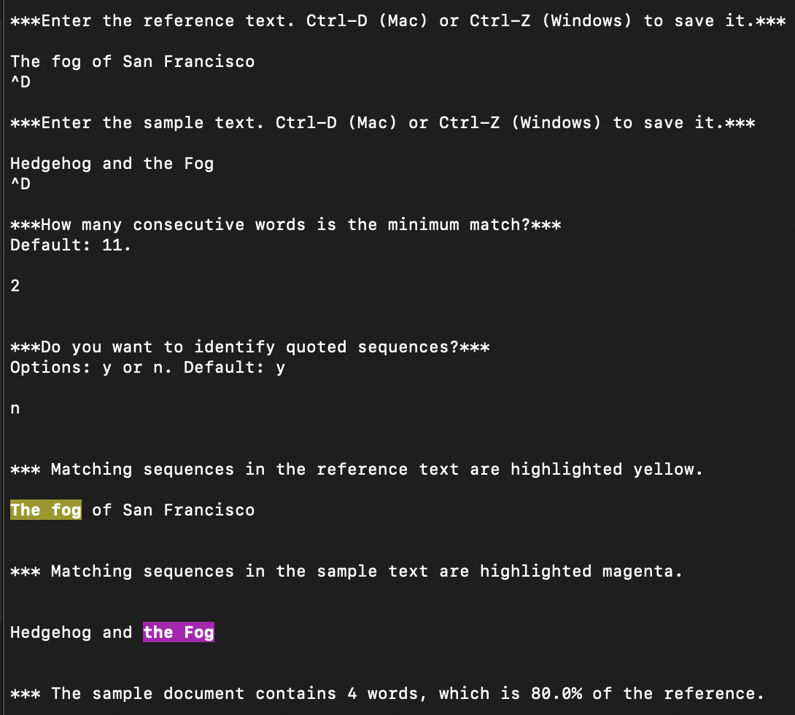
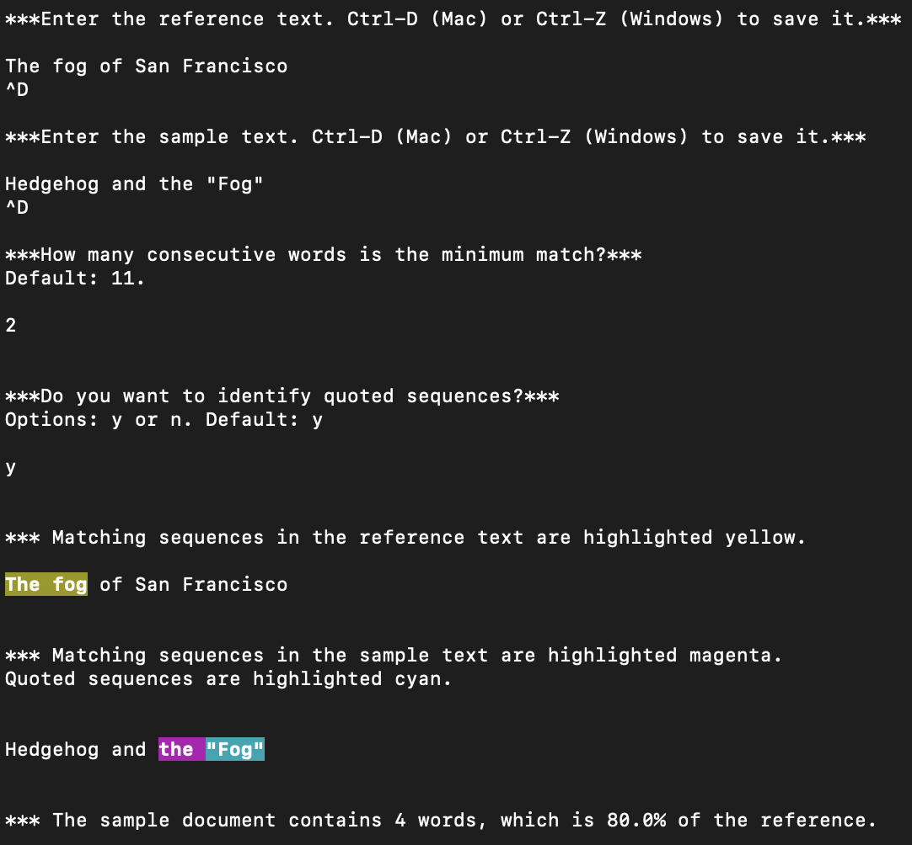

# Copycheck
Copycheck is a module that identifies matching sequences of tokens between two strings. 

## Description
This module was created to address the need to match a verbatim sequence of words between two documents that would constitute a copyright violation. 
Throughout the module, the original document is referred to as the *reference* and the document citing the reference as a source is called the *sample*. 
Let's first assume that there is a minimum threshold for the length of a match sequence to constitute plagiarism or a copyright violation, e.g. >10 words. Let's call this the *frame size*. 
To determine this manually, we would have to select words 0-10 from the sample and "control-F" it in the reference. 
We would then have to shift over one word, now selecting words 1-11, and perform the search again, continuing until we reach words n-11 to n. 
Copycheck automates this operation by handling it as a pattern-matching problem -- similar to image recognition. 

The main considerations in implementing such a pattern matcher were minimizing the:
- number of libraries that would have to be imported, and
- computational complexity of the operation.
  
This was achieved by leveraging vectorized operations in NumPy arrays. 
Accepting the computational overhead of converting strings to NumPy integer arrays and performing regex-based text processing, unnecessary, repetitive, or loopy operations are avoided down the line. 

## Pipeline
The following is a step-by-step description of the copycheck process:
1. The reference and sample documents are read on-line as input strings and processed to normalize potential variations in punctuation.
   
2. The strings are tokenized to preserve formatting such as newline characters.
   1. Rather than using the traditional method of tokenizing a string based on whitespace, regex *split()* was used to demarcate tokens on all whitespace characters and dashes and preserve them.
      ```python
        import re
        text = "\tHello Earth-world\n\n!"
        toknized = re.split('([\s—–-]+)', text)
    
        >>> tokenized
        ['\t', 'Hello', ' ', 'Earth-', 'world', '\n\n', '!']
      ```
   
   2. Then a function is used to pair each non-word token with a word token such that each token contains one word. Let's call this function *paired*.
      ```python
        >>> paired(tokenized)
        ['\tHello ', 'Earth-', 'world\n\n!']
      ```
    Let's combine these two steps into one function called *to_list()*. This style of tokenized text will help us split hyphenated words and dashes (the only punctuation that does not require space). Crucially, *to_list()* allows us to strip all non-word characters when pattern-matching while preserving the original formatting for reassembling the output, which will be a copy of the input with matching sequences highlighted. 

3. Each unique word (type) is assigned an integer value using a dictionary to convert each string into an array of integers. Let's call this *word2num*. 
    ```python
    text = "World one:\tEarth\nWorld two:\tMars."
    >>> print(text)
    World one:  Earth
    World two:  Mars.
    
    tokenized = to_list(text)
    >>> tokenized
    ['World ', 'one:\t', 'Earth\n', 'World ', 'two:\t', 'Mars.']
    
    normalized = [re.sub(r'[^\w\']', '', token.lower()) for token in tokenized]
    >>> normalized
    ['world', 'one', 'earth', 'world', 'two', 'mars']
    
    >>> word2num(normalized)
    [0, 1, 2, 0, 4, 5]
    ```

4. The sample and reference arrays are restructured into overlapping sliding frames of indices. Suppose our 'document' is an array of the alphabet from 'a' to 'z'.
    ```python
    ['a' 'b' 'c' 'd' 'e' 'f' 'g' 'h' 'i' 'j' 'k' 'l' 'm' 'n' 'o' 'p' 'q' 'r' 's' 't' 'u' 'v' 'w' 'x' 'y' 'z']
    ```
   
    The indices of the document will be the following.
    ```python
    [ 0  1  2  3  4  5  6  7  8  9 10 11 12 13 14 15 16 17 18 19 20 21 22 23 24 25]
    ```
   
    Now given a frame size of 11 we create frames of sliding indices from 0 to 25.   
   ```python
    [[ 0  1  2  3  4  5  6  7  8  9 10]
     [ 1  2  3  4  5  6  7  8  9 10 11]
     [ 2  3  4  5  6  7  8  9 10 11 12]
     [ 3  4  5  6  7  8  9 10 11 12 13]
     [ 4  5  6  7  8  9 10 11 12 13 14]
     [ 5  6  7  8  9 10 11 12 13 14 15]
     [ 6  7  8  9 10 11 12 13 14 15 16]
     [ 7  8  9 10 11 12 13 14 15 16 17]
     [ 8  9 10 11 12 13 14 15 16 17 18]
     [ 9 10 11 12 13 14 15 16 17 18 19]
     [10 11 12 13 14 15 16 17 18 19 20]
     [11 12 13 14 15 16 17 18 19 20 21]
     [12 13 14 15 16 17 18 19 20 21 22]
     [13 14 15 16 17 18 19 20 21 22 23]
     [14 15 16 17 18 19 20 21 22 23 24]
     [15 16 17 18 19 20 21 22 23 24 25]]
    ```
   
   The document corresponding to the indices above becomes the following.
    ```python
    [['a' 'b' 'c' 'd' 'e' 'f' 'g' 'h' 'i' 'j' 'k']
     ['b' 'c' 'd' 'e' 'f' 'g' 'h' 'i' 'j' 'k' 'l']
     ['c' 'd' 'e' 'f' 'g' 'h' 'i' 'j' 'k' 'l' 'm']
     ['d' 'e' 'f' 'g' 'h' 'i' 'j' 'k' 'l' 'm' 'n']
     ['e' 'f' 'g' 'h' 'i' 'j' 'k' 'l' 'm' 'n' 'o']
     ['f' 'g' 'h' 'i' 'j' 'k' 'l' 'm' 'n' 'o' 'p']
     ['g' 'h' 'i' 'j' 'k' 'l' 'm' 'n' 'o' 'p' 'q']
     ['h' 'i' 'j' 'k' 'l' 'm' 'n' 'o' 'p' 'q' 'r']
     ['i' 'j' 'k' 'l' 'm' 'n' 'o' 'p' 'q' 'r' 's']
     ['j' 'k' 'l' 'm' 'n' 'o' 'p' 'q' 'r' 's' 't']
     ['k' 'l' 'm' 'n' 'o' 'p' 'q' 'r' 's' 't' 'u']
     ['l' 'm' 'n' 'o' 'p' 'q' 'r' 's' 't' 'u' 'v']
     ['m' 'n' 'o' 'p' 'q' 'r' 's' 't' 'u' 'v' 'w']
     ['n' 'o' 'p' 'q' 'r' 's' 't' 'u' 'v' 'w' 'x']
     ['o' 'p' 'q' 'r' 's' 't' 'u' 'v' 'w' 'x' 'y']
     ['p' 'q' 'r' 's' 't' 'u' 'v' 'w' 'x' 'y' 'z']]
    ```
    
5. Each sample frame must be compared to all reference frames. Let's introduce a simple example to illustrate this. We want to compare
    ```python
    reference = "The fog of San Francisco"
    sample = "Hedgehog and the Fog"
    ```
     
    Using a dictionary that stores each unique word (type) at the index first encountered, we can convert a list of strings to a list of integers. Let's call this function 'word2num'.  
    - Note: any word that exists in the sample document, but not the reference document, will be arbitrarily assigned -1, since there is no chance for it to be in a match sequence.
    
    ```python
    >>> word2num(to_list(reference))
    [0, 1, 2, 3, 4]
   
    >>> word2num(to_list(sample))
    [-1, -1, 0, 1]
    ```

    Now let's say we want to match 2-word sequences, so a frame size of two. We create the sliding frames discussed above to achieve the following. 
    ```python
    >>> reference_frames
    [[0 1]
     [1 2]
     [2 3]
     [3 4]]
   
    >>> sample_frames
    [[-1 -1]
     [-1  0]
     [ 0  1]]
    ```
     
    But remember, each sample frame must be compared to every reference frame.
    ```python
   # FRAME 0: 
   # Does [-1 -1] = [[0 1], [1 2], [2 3], [3 4]]?
    >>> sample_frames[0] == reference_frames
    [[False, False],
     [False, False],
     [False, False],
     [False, False]]
   
   # FRAME 1:
   # Does [-1  0] = [[0 1], [1 2], [2 3], [3 4]]?
    >>> sample_frames[1] == reference_frames
    [[False, False],
     [False, False],
     [False, False],
     [False, False]]
   
   # FRAME 2:
   # Does [ 0  1] = [[0 1], [1 2], [2 3], [3 4]]?
    >>> sample_frames[2] == reference_frames
    [[ True,  True],
     [False, False],
     [False, False],
     [False, False]]
    ```
    
    To achieve this efficiently, we need to move to the 3rd dimension by stacking each of the three frames (listed above) on top of each other to form a cube, so we actually compare everything at once!

    ```python
    >>> sample_frames
    [[[-1, -1]],

     [[-1,  0]],

     [[ 0,  1]]]
   
   >>> reference_frames
    [[[0, 1],
      [1, 2],
      [2, 3],
      [3, 4]],

     [[0, 1],
      [1, 2],
      [2, 3],
      [3, 4]],

     [[0, 1],
      [1, 2],
      [2, 3],
      [3, 4]]]
   
   # One comparison yields the same result as three separate comparisons
   # in the window above stacked on each other. 
   >>> matches = reference_frames == sample_frames
   >>> matches
   [[[False, False],
      [False, False],
      [False, False],
      [False, False]],

     [[False, False],
      [False, False],
      [False, False],
      [False, False]],

     [[ True,  True],
      [False, False],
      [False, False],
      [False, False]]]
   
   # Bring the match tensor back down to 2D space by evaluating each Boolean pair. 
   # Now the horizontal axis shows which word pair is a match in the reference,
   # the vertical axis show which pair is a match in the sample. 
   >>> matches.all(2)
   [[False, False, False, False],
     [False, False, False, False],
     [ True, False, False, False]]
    ```
     
   Finally, by using the convolve function on the match matrix along the horizontal and vertical axes,
   we attain a Boolean mask array for the reference and a Boolean mask array for the sample, respectively. These evaluate True for each match token.
   ```python
   # A 1D Boolean array corresponding to the length of the reference doc. 
   >>> reference_mask = np.convolve(matches.any(0), np.ones((frame_size), dtype=int))
   >>> reference_mask
   [1, 1, 0, 0, 0]
   >>> reference_mask = reference_mask > 0
   >>> reference_mask
   [ True,  True, False, False, False]
   >>> reference 
   'The fog of San Francisco'
   
   # A 1D Boolean array corresponding to the length of the sample doc.
   >>> sample_mask = np.convolve(matches.any(1), np.ones((frame_size), dtype=int)) 
   >>> sample_mask
   [0, 0, 1, 1]
   >>> sample_mask = sample_mask > 0
   >>> sample_mask
   [False, False,  True,  True]
   >>> sample
   'Hedgehog and the Fog'
   ```
   As you can see, each mask evaluates True in the postion of the sequence "the fog".

6. These masks are imposed on the original tokenized documents and color-coded (formatted to change the background color of the text) if a token is paired with True.
8. Matches that are in quotation marks are optionally color-coded.
9. The module finally prints a formatted version of the reference and sample documents that highlights matching sequences:

## Instructions 
This code is meant to be run in command terminal.

1. Get the code.
```shell
git clone https://github.com/emilminas/copycheck.git
```
2. Use chmod to be able to execute the program. 
```shell
chmod +x copycheck.py
```
3. Execute the program
```shell
./copycheck.py 
```
4. Enter all requited inputs. The outputs highlight matching sequences. 


5. Here is an example displaying optional color-coding for quoted matched. 


## Roadmap
There are three categories of improvement that should be implemented.
1. Further testing and refinement of the existing code.
2. Implementation of named entity recognition (NER) to identify proper nouns in matched sequences. This can be very simply done with NLTK or spaCy, which (I think) uses HMM-based tagging. However, if additional libraries are to be avoided, it is possible to implement a very rudimentary/naive NER leveraging English language capitalization rules with regex. I'm actually in the process of smoothing out a simple regex-based solution, which obviously won't be as good as NLTK, but it's a "quick and dirty" solution. 
3. A front end should be developed to make the code more user-friendly. The ability to customize highlighter color, maybe via a color wheel, should be added. There could also be an added match word counter, saving the user from having to count words in a visually highlighted sequence. 

## Final thoughts
I welcome any suggestions on how to improve this code. I welcome pull requests. For major changes or any use of my code for other purposes, please open an issue or contact me. 
  